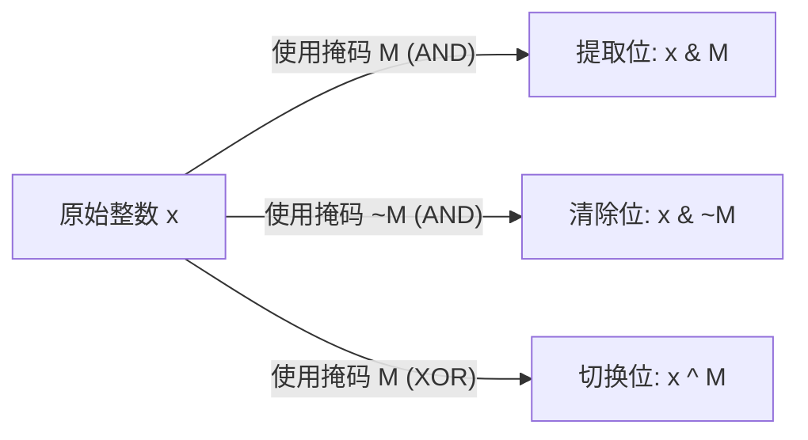

# 位运算的系统性总结

**执行摘要:** 位运算是对整数的二进制表示（各个位）执行逻辑运算的一类操作，包含按位与（`&`）、或（`|`）、异或（`^`）、取反（`~`）以及左移/右移等。本文面向熟悉编程与算法的读者，系统介绍了位运算的定义、真值表和概念，归纳了其代数性质（交换律、结合律、分配律、吸收律、德摩根定律、幂等律、逆元等）并给出按位证明或直观说明，列举了重要恒等式（如 `x^x=0`, `x&0=0`, `x|0=x`, `x&~x=0`, `x^~x=-1` 等）及符号数/无符号语义下的注意事项。针对常见的位掩码技巧，说明了提取最低位、清除最低位、取最高位、奇偶判断、交换变量（不借助临时变量）、计数二进制1位数（布赖恩·柯尼汉算法、查表法、内置指令）等，并给出 C/C++ 与 Python 代码示例和时间复杂度分析。总结了位运算在算法竞赛和系统编程中的典型应用场景（状态压缩DP、位集/布隆过滤器、哈希/加密/校验、位图索引等）并配有简要示例。文章还提供了按公式难度比较的表格以及用 Mermaid 画出的掩码位操作流程示意图。文中引用了权威资料（维基百科、Hacker’s Delight、ISO C 标准等）并在文末给出进一步阅读建议与练习题。

## 位运算定义与真值表

位运算是逐位（bitwise）应用布尔逻辑运算于整数的二进制位。假设对两位（bit）`a, b`应用位运算，则有以下基本定义：

- **按位与 (AND, `&`)：** 对应位均为 1 时结果为 1，否则为 0。例如 `1011 & 0110 = 0010`。
- **按位或 (OR, `|`)：** 对应位只要有一个为 1 结果为 1，否则为 0。例如 `1011 | 0110 = 1111`。
- **按位异或 (XOR, `^`)：** 对应位只有一个为 1 时结果为 1，否则为 0。例如 `0101 ^ 0011 = 0110`。
- **按位取反 (NOT, `~`)：** 将每个位 0 ↔ 1 取反。对于二进制数 `b`，取反结果为每一位翻转；在二补数系统中满足 `~x = -x - 1`。
- **左移 (<<)**：将二进制位整体向左移动，高位溢出丢弃，低位补 0，相当于乘以 2（但可能溢出）。  
- **右移**：有“算术右移”和“逻辑右移”之分。算术右移（通常用于有符号整数）会在高位补符号位（保持正负），逻辑右移在高位补 0（相当于无符号整数右移）。

可用真值表（单个位）表示上述运算，列举 `a,b` 的所有组合：  
```
a b | a&b | a|b | a^b
0 0   0     0     0
0 1   0     1     1
1 0   0     1     1
1 1   1     1     0
```
从定义可见，`1 & 1 = 1`，`1 | 0 = 1`，`1 ^ 1 = 0`，`0 ^ 1 = 1`，`~0 = 1`，`~1 = 0`。按位运算在编程语言中直接作用于整数的二进制表示，例如 C/C++ 中用 `& | ^ ~ << >>` 进行位操作。

## 代数性质与按位验证

位运算继承了布尔代数的许多性质。对任意整数的每一位进行逻辑运算，上述运算满足如下代数律：

- **交换律 (Commutative)：**  
  - `x & y = y & x`；`x | y = y | x`；`x ^ y = y ^ x`。  
  证明：逐位看，无论交换操作数顺序，逻辑与/或/异或结果不变（见真值表可验证对称性）。
- **结合律 (Associative)：**  
  - `(x & y) & z = x & (y & z)`，同理对于 `|` 和 `^`。  
  逐位来说，这是布尔运算的结合律，可直接用真值表或自反性质证明。
- **幂等律 (Idempotent)：**  
  - `x & x = x`，`x | x = x`（布尔与/或幂等）。  
  对于每一位，`a & a = a`；`a | a = a`。
- **吸收律 (Absorption)：**  
  - `x | (x & y) = x`，`x & (x | y) = x`。  
  证明：逐位看，若位 `x` 为 1，则 `x & y` 位为 0 或 1，`x | (x&y)` 位为 1；若位 `x` 为 0，则 `x & y` 为 0，结果为 0。因此总等于 `x`，类似可证另一式。
- **德摩根律 (De Morgan)：**  
  - `~(x & y) = ~x | ~y`，`~(x | y) = ~x & ~y`。  
  这是布尔代数经典律，对每一位皆成立：`a & b = 1` 当且仅当 `a=b=1`，取反后同于 “有一个不是 1” 等价于 `~a | ~b`。
- **分配律 (Distributive)：**  
  - `x & (y | z) = (x & y) | (x & z)`；  
  - `x & (y ^ z) = (x & y) ^ (x & z)`。  
  证明：逐位验证即可。例如 `(x^y)&z = (x&z)^(y&z)`。考虑单个位：若 `z=0`，则左式为 0，右式中 `(x&0)^(y&0)=0^0=0`；若 `z=1`，左式为 `x^y`，右式为 `(x)^(y)`，相同。因此 `(x^y)&z = (x&z)^(y&z)` 对所有位都成立。对称地，`x&(y^z) = (x&y)^(x&z)` 也成立。  
  需要注意的是：**XOR 不分配于 AND/OR，OR 也不分配于 XOR**。例如，设 `x=1,y=1,z=1`，则 `x | (y ^ z) = 1 | (1^1) = 1 | 0 = 1`，而 `(x | y) ^ (x | z) = (1|1)^(1|1) = 1^1 = 0`，不相等，这说明 OR 对 XOR 无分配律。
- **逆元 (Inverse)：**  
  - 对异或运算而言，`x ^ x = 0`（即自身为其逆元，恒为 0）；  
  - 对于按位取反，`~x` 是 `x` 的 “按位逆元”，即 `x ^ ~x` 在二进制下结果全为 1。对无符号数来说，这等于该位宽的最大值（例如 32 位全 1）；在二补数有符号语义下即为 `-1`。例如 `x=5 (0101₂)`，`~x = 1010₂`，`x^~x = 1111₂ = -1`（若视为 4 位二补数），因此 `x^~x = -1`。

综上，多数位运算性质均对应布尔代数在二进制上的逐位应用（即“逐位成立”）。下表归纳了常用恒等式、证明难度、逐位是否成立及应用场景：

| 公式                          | 证明难度     | 是否逐位成立 | 适用场景/备注                   |
|:-----------------------------|:-----------:|:----------:|:-------------------------------|
| `x ^ x = 0`                 | 简单         | 是         | 异或自反律，常用于清零相同位       |
| `x & 0 = 0`                 | 简单         | 是         | 与零得零，用于清空数据           |
| `x | 0 = x`                 | 简单         | 是         | 或零恒等律，构造位未改变值       |
| `x & ~x = 0`                | 简单         | 是         | 位与自身取反恒为0（无重叠位）    |
| `x | ~x = ~0（全1）`        | 简单         | 是         | 位或自身取反恒为全1             |
| `x ^ ~x = ~0（全1）`        | 简单         | 是         | 同上，对于二补数下即 `-1`       |
| `~(~x) = x`                 | 简单         | 是         | 双重取反还原                  |
| `(x^y)&z = (x&z)^(y&z)`     | 中等（真值表） | 是         | 按位与对异或的分配律 |
| `(x&y)|x = x`              | 简单         | 是         | 吸收律（与/或互吸收）   |
| `~(x&y) = ~x | ~y`         | 简单         | 是         | 德摩根律            |
| 其他：交换律、结合律等     | 简单         | 是         | 基本代数律（不再逐一列出）        |

## 位掩码技巧与常用模式

位掩码（bitmask）是用特定位模式控制或查询数据的技术。通过与、或、异或操作，可以快速实现**提取**、**清除**、**切换**指定的位。位掩码常见规律有：

- **置 1（打开）某位：** 对应位 `Y`，执行 `Y OR 1 = 1`；要保持 `Y` 不变，执行 `Y OR 0 = Y`。因此使用掩码把目标位设为 1 只需对该位用 1，其余用 0，与数据做 `OR` 操作。
- **置 0（清除）某位：** 对应位 `Y`，执行 `Y AND 0 = 0`；保持不变时 `Y AND 1 = Y`。故要清除目标位，用掩码在该位为 0（其他为 1）与原值做 `AND` 即可。
- **切换（翻转）某位：** 对应位 `Y`，`Y XOR 1` 等价于翻转：若原为 1 则变 0，原为 0 则变 1；而 `Y XOR 0 = Y` 保持不变。因此对目标位用 1，其余用 0，与原值做 `XOR` 可按位翻转。

 *图：使用二进制掩码将精灵前景与背景合成的示意图（黑色像素掩码为0保留背景，白色为1叠加前景）。*

例如，图中掩码示例中对背景与精灵图同时进行按位运算：先对背景像素与掩码做 **与** 运算（黑色位0清零，白色位1保留），然后对结果与精灵像素做 **或** 运算，实现透明区域遮盖。此外，对某个位判断奇偶（最低位）只需 `x & 1`（若结果为 1 则为奇数），交换两个整数不借助临时变量可用异或技巧 `a ^= b; b ^= a; a ^= b;`（前提 `a`,`b` 不指向同一存储位置），因为异或自反律 `x^x=0`使交换有效。

提取/清除最低有效位的经典技巧包括**提取最低位 1**：`x & -x`，（由于二补数 `-x = ~x + 1`，此操作将仅保留最低位的 1）；**清除最低位 1**：`x & (x - 1)`（将最低位的 1 置零）。例如 C 代码 `while(v) { c++; v &= v - 1; }` 每次循环 `v &= v-1` 操作清除 `v` 的最低 1，当 `v` 变 0 时循环结束，实现了Brian Kernighan算法的位计数。

**计数二进制1的算法：**  
- **Brian Kernighan算法：** 如上，对每次操作 `v &= v - 1` 清除一个1，循环次数为1的个数，时间复杂度取决于1的个数（最坏O(位数)）。  
- **查表法：** 对于固定宽度（如32位），可预先构造256条 `0–255` 的位计数字典。将整数拆分为若干字节，用查表方式并相加，时间复杂度约为 O(位数/8)。  
- **内建指令：** 现代编译器提供内建函数，如GCC的 `__builtin_popcount` (C/C++) 或Python的 `int.bit_count()`，利用硬件/优化方法实现，时间复杂度一般可视为 O(1)（硬件常数时间）或 O(位数/机器字) 确定。  

下面给出 C++ 与 Python 的示例代码片段：  
```cpp
// C++: 交换两数（不借助额外变量）
void swap_xor(int &a, int &b) {
    a ^= b;
    b ^= a;
    a ^= b;
}
// C++: 计数1位数（Brian Kernighan算法）
int popcount(unsigned int v) {
    int c = 0;
    while (v) {
        v &= (v - 1); // 清除最低位的1
        c++;
    }
    return c;
}
```  
```python
# Python: 检查最低位是否为1（奇偶判断）
def is_odd(x):
    return (x & 1) == 1

# Python: 计数1位（使用内置方法）
def popcount(x):
    return x.bit_count()  # Python 3.8+ 内置函数
```
上述技巧时间复杂度均为常量级或与位宽线性相关（一般认为 O(1) 或 O(位长)）。


*图：位掩码应用流程示意。输入整数 `x`，根据掩码 `M` 执行按位操作，实现提取（`x&M`）、清除（`x&~M`）和切换（`x^M`）等操作。*

## 算法竞赛与系统编程中的应用

位运算广泛应用于算法竞赛和底层系统中。典型场景包括：

- **状态压缩 DP：** 用位掩码表示子集状态或可行标志。例如，旅行商问题可用一个整数 `mask` 的二进制位表示已访问城市集，在转移时用 `(mask & (1<<i))` 检查或 `mask | (1<<i)` 添加城市。遍历子集常用技巧：  
  ```cpp
  for(int sub = mask; sub; sub = (sub - 1) & mask) {
      // 遍历 mask 的所有非空子集 sub
  }
  ```
  这能在 O(3^n) 等枚举复杂度下快速遍历子集。

- **位集 (bitset)：** 使用如 C++ 的 `std::bitset` 或 Python 的 `int` 作为位图来存储布尔集合，利用按位运算进行并交差（OR/AND）等快速操作。例如合并多个特征集时用 `bitsetA |= bitsetB`。

- **布隆过滤器 (Bloom Filter)：** 用一组位向量和哈希函数来检测元素是否可能存在。添加元素时对若干哈希值设位（`bitArray |= mask`），查询时检验所有对应位是否为1，用到位或和位与操作。

- **哈希与加密：** 位运算用于设计快速混合函数、生成校验和。例如流密码常用按位异或来叠加伪随机位；CRC 校验借助异或和移位。

- **位图索引 (Bitmap Index)：** 数据库和搜索中使用位图来快速筛选。查询条件转化为位掩码，对位图执行 AND/OR 加速集合操作。

以上场景中，位运算将高阶逻辑简化为低开销的位操作，典型示例如掩码标志、位压缩存储等。

## 常用公式比较

下表比较了一些常见公式、证明难度及适用场景：

| 公式            | 难度   | 逐位成立 | 适用场景/说明               |
|:---------------|:-------:|:--------:|:--------------------------|
| `x^x = 0`     | 简单    | 是      | 清零相同位（异或自反）      |
| `x&0 = 0`     | 简单    | 是      | 初始清零                    |
| `x|0 = x`     | 简单    | 是      | 恒等初始                    |
| `x&~x = 0`    | 简单    | 是      | 位与自身取反结果全0          |
| `x^~x = -1`   | 简单    | 是      | 所有位取反（全1）；无符号下为最大值 |
| `~(~x) = x`   | 简单    | 是      | 双重取反                   |
| `~x = -x-1`   | 简单    | 是      | 二补数性质   |
| `(x^y)&z = (x&z)^(y&z)` | 中等 (真值表) | 是 | 逐位分配律 (AND 对 XOR) |
| `x | (x&y) = x` | 简单    | 是      | 吸收律        |
| `~(x&y) = ~x|~y` | 简单    | 是      | 德摩根律      |
| 其他交换/结合律  | 简单    | 是      | 布尔代数基础律             |

## 进一步阅读与练习题

**推荐阅读：**  
- Donald E. Knuth 等，《计算机程序设计艺术》（*The Art of Computer Programming*）卷 4《组合算法》中有关位算法的讨论；  
- Henry S. Warren, Jr.，《Hacker’s Delight》（含大量位操作技巧）；  
- 《ISO/IEC 9899:2011 C标准》（定义按位运算的行为）；  
- GCC 和 Clang 文档（`__builtin_popcount`、`__builtin_ctz` 等内建函数）；  
- 维基百科《布尔代数》和《位操作》等条目。  

**练习题：**  
1. 证明按位运算的交换律和结合律对所有位成立（难度★☆☆）。  
2. 给定 `x = 29 (11101₂)`, `y = 14 (01110₂)`, 手工计算 `x & y`, `x | y`, `x ^ y`, `~x`（按 5 位二补数），并验证公式 `~(x & y) = ~x | ~y`（难度★★☆）。  
3. 编写 C++ 函数 `highest_bit(x)`，返回非负整数 `x` 的最高位（值为 `2^k`）的位置（位从 0 开始），要求使用位运算，不使用循环（难度★★★）。  
4. 状态压缩 DP：对 4 个城市做 TSP 问题，用位掩码表示访问状态。写出状态转移方程并给出实现示例（难度★★★）。  
5. 对于上表中“OR 是否对 XOR 可分配”一律，找出一个反例并解释其原因（难度★★☆☆）。